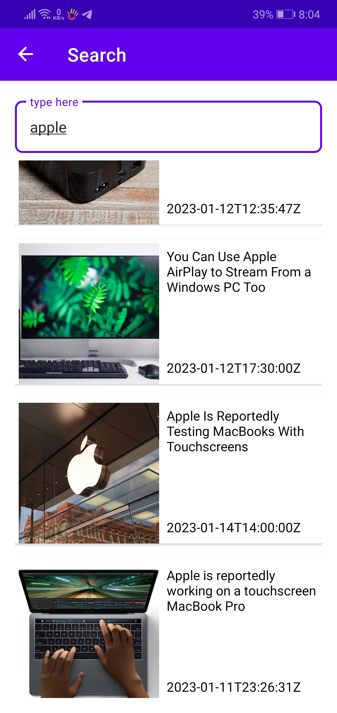

# News Android App

An android app helps user to collect many different news such as business,
sports, science and technology.

API from [newsapi.org](https://newsapi.org/)
## Tools and Dependencies

* Retrofit 
* Navigation Component
* Glide
* MVVM
* Hilt
* Coroutines
* Clean Architecture

```
implementation 'androidx.core:core-ktx:1.7.0'
    implementation 'androidx.appcompat:appcompat:1.5.1'
    implementation 'com.google.android.material:material:1.7.0'
    implementation 'androidx.constraintlayout:constraintlayout:2.1.4'
    testImplementation 'junit:junit:4.13.2'
    androidTestImplementation 'androidx.test.ext:junit:1.1.5'
    androidTestImplementation 'androidx.test.espresso:espresso-core:3.5.1'

    //Navigation
    def nav_version = "2.5.3"
    implementation("androidx.navigation:navigation-fragment-ktx:$nav_version")
    implementation("androidx.navigation:navigation-ui-ktx:$nav_version")

    //Hilt
    implementation("com.google.dagger:hilt-android:2.44")
    kapt("com.google.dagger:hilt-android-compiler:2.44")

    //coroutine
    implementation("org.jetbrains.kotlinx:kotlinx-coroutines-android:1.3.9")

    //retrofit
    implementation 'com.squareup.retrofit2:retrofit:2.9.0'
    implementation 'com.squareup.retrofit2:converter-gson:2.9.0'
    implementation 'com.squareup.retrofit2:converter-moshi:2.9.0'
    implementation 'com.squareup.retrofit2:converter-scalars:2.9.0'

    //Glide
    implementation 'com.github.bumptech.glide:glide:4.14.2'
    annotationProcessor 'com.github.bumptech.glide:compiler:4.14.2'
```

## Screenshots





